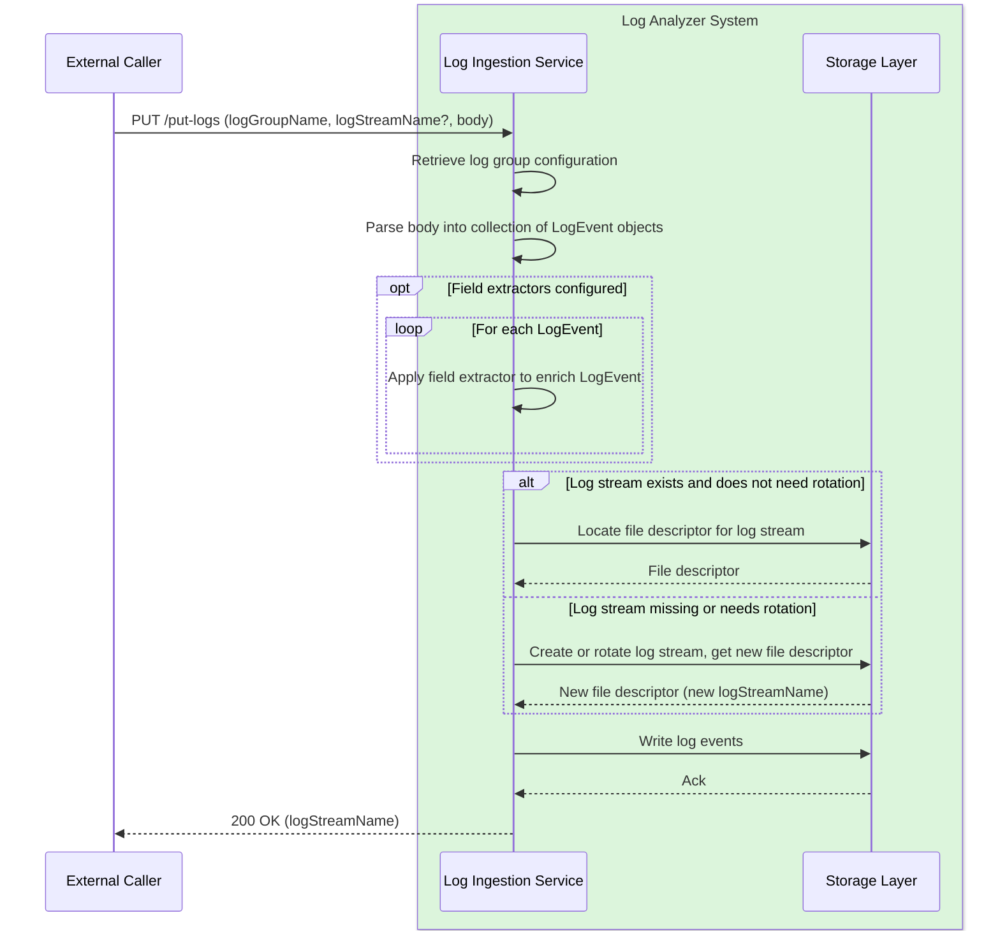

# ADR 2 - Initial ingestion layer

This ADR covers requirements R00, R01 and R03-05 from the [high-level design](high-level-design.md). Note that this ADR hinges upon the conclusions of [ADR1 (log group configuration)](adr1-log-group-and-log-stream-concepts.md), so we will not come back on the notions of log group and log stream.

We will cover the following design topics, in this order:

- the PUT API to send data to the service
- the log agent (side-car process) collecting logs on disk, integrating with the PUT API and handling batching, retries and log rotation
- the data model for `LogEvent`
- the concepts of `Parser`, converting a given input data type into a `LogEvent` and `Enricher` or `FieldExtractor`, allowing to plug extra parsing behaviour to add more indexable fields than the default parser supports

## put-logs API

The `put-logs` API will be a synchronous HTTP endpoint allowing to send a batch of raw log events, in a push model. Latency should be kept low, therefore the API will enforce a maximum payload size in bytes, as well as in number of log events. These limits will be defined at the API level, and will not be configurable per log group.

Below is the contract of the endpoint:

**Request**
- `logGroupName: String`
- `logStreamName: String?`. If omitted, a new log stream will be created and the logs will be appended into it.
- `body: blob`. A binary payload containing a collection of raw log events, which will all have to match the format type associated to the corresponding log group. The request's `Content-Type` will declare the payload format and will have to be consistent with the log group's configured format; we will throw otherwise. If the payload is compressed, the `Content-Encoding` header will declare the algorithm.
  Supported content types: `text/plain` (used for both `plain-text` and `logfmt`), `application/json`.
  Supported encodings: `identity`, `gzip`.

**Response**

- `logStreamName: String`. The actual log stream into which the data was written. It can be different from the value passed in the request either if it was missing in the request, or if the log stream has been rotated according to the log group's configuration to respect the maximum byte size.

**Errors**
- 400 status code if the request is invalid (e.g. un-parsable content, mismatching content type, missing log group name etc)
- 404 status code if the log group or log stream specified do not exist
- 413 if the payload exceeds the maximum byte size or maximum number of records
- regular HTTP error codes for generic issues

The API will access the cached configuration of log groups to correctly handle parsing and custom field extraction if applicable. The high-level flow is described in the sequence diagram below.



## Log agent

In practice, most clients would not want to integrate directly with the `put-logs` API. A more common production use case is to have a local log file, potentially locally rotated, which gets streamed to the log ingestion service in micro-batches, ensuring low latency for the logs to become available and searchable, which is essential for monitoring use cases.

We therefore need a component which listens to local files, creates batches of log events and sends them over to the ingestion service via the API. This component need to meet a number of technical requirements:
- **Performance**: a single service may emit large amounts of logs, which need to be submitted at least as fast as they are produced, without taking too much CPU (tasks such as log compression can at time impact production services... I've seen it).
- **Concurrency**: a single service may maintain multiple distinct log files. It could become inefficient to send logs sequentially if there are many different log groups to publish to, or a very large amount of batches to send. parallelism or at least concurrency should help with that, as this workload is mostly network-bound (expect for compression which is CPU-bound, which is why we may need both parallelism and concurrency).
- **Fault-tolerance**: if you cannot trust your logs and metrics, your cannot trust anything. We need a high degree of fault-tolerance baked in to survive, with degraded behavior sometimes, things such as corrupted logs, temporary ingestion service issues, temporary network issues etc.

It is common to use a log agent for this task. In our case, the log agent — which we'll call `log-nanny` — is packaged as a separate zip containing the poller jar, a launch script, and the service-manager configuration needed to supervise it. At runtime it consists of a single poller process, which performs the actual work, kept alive by the operating system's service manager.

### Process supervision with launchd

Rather than hand-rolling a supervisor process, we delegate supervision to the operating system's service manager. For now we target **macOS only** — consistent with the Unix-only constraint that the inode-based checkpointing imposes (see below), and sufficient for running the tool on a developer's Mac — so we use **launchd**. A Linux variant could be added later using `systemd` with the poller itself unchanged; only the service definition differs.

launchd provides, declaratively, everything the supervisor needs:
- **Singleton ownership**: a single LaunchAgent maps to a single managed instance, so we cannot accidentally run two pollers publishing the same logs. This removes the need for any custom locking or process scanning to enforce uniqueness — logic that is surprisingly easy to get wrong (e.g. two instances racing at startup).
- **Restart on failure**: `KeepAlive`, conditioned on a non-zero exit code, restarts the poller if it dies, while launchd's built-in respawn throttling (a ~10s minimum between restarts) prevents a crash loop from spinning hot.
- **Graceful shutdown**: on stop, launchd sends `SIGTERM` and waits before escalating to `SIGKILL`, giving the poller time to flush its in-flight batch and write its checkpoint before exiting.

The poller is thus a plain process that reads its config, does its work, and exits non-zero on unrecoverable errors; all liveness concerns are owned by launchd. The agent zip ships a `.plist` template plus a small install script that renders it (file paths, config location) and loads it with `launchctl`. Users should still monitor log volumes to detect anomalies in case ingestion is down for some other reason.

One gap to note: launchd offers little in the way of resource capping, so we cannot bound the poller's CPU usage at the service-manager level — a concern given that compression is CPU-bound. For now we rely on the poller's own concurrency limits to keep its footprint modest; a future `systemd` variant could enforce hard CPU/memory caps via cgroups.

### Log poller configuration and behaviour

The log poller will be written in Kotlin, and have configurable behaviour. Configuration will happen in a local TOML file, with one TOML table per log group to publish to. The table name is the target log group name — the same name registered with the ingestion service. The following settings are available per table:

| Configuration key         | Type    | Default value | Semantic                                                                                                                                                                                                                                                                                                                                                                                                | Examples                                                     |
| ------------------------- | ------- | ------------- | ------------------------------------------------------------------------------------------------------------------------------------------------------------------------------------------------------------------------------------------------------------------------------------------------------------------------------------------------------------------------------------------------------- | ------------------------------------------------------------ |
| `log.files.root`          | string  | cwd           | Directory containing the log files for this log group.                                                                                                                                                                                                                                                                                                                                                  | Any valid path                                               |
| `log.files.pattern`       | string  | N/A           | Limited glob to describe the path of the files that should be captured in a given log group. Only `*` is supported.                                                                                                                                                                                                                                                                                     | `application.log.*`                                          |
| `log.format`              | enum    | `plain-text`  | Log format. Supported values: `plain-text`, `json`, `logfmt`                                                                                                                                                                                                                                                                                                                                            | `logfmt`                                                     |
| `log.date.field`          | string  | `timestamp`   | For `json` and `logfmt`, name of the field containing the timestamp. If the field is missing, the poller-side ingestion time (when the poller reads the event) will be used as a fallback. Ignored for `plain-text`.                                                                                                                                                                                    | Any non-empty string                                         |
| `log.date.format`         | string  | N/A           | Java date pattern used to compute the event's timestamp as well as correctly separate log events. It is required to support multi-line events (typical for Java stacktraces). The date should be the first thing on the line to be considered an event. If missing, each log line is assumed to be an event and its timestamp will be the poller-side ingestion time. Ignored for `json` and  `logfmt`. | `YYYY-MM-dd'T'HH:mmZ`                                        |
| `log.maxEventByteSize`    | string  | `1M`          | Maximum byte size for a single event, protecting against corrupted logs or abnormally large events. For `json` and `logfmt`, an oversized event will be dropped, since clipping would produce unparseable structured data; for `plain-text` it will be clipped to this size.                                                                                                                            | `1024` (1 kilobyte)                                          |
| `log.transit.compression` | enum    | `gzip`        | Compression applied to the request body before sending it to `put-logs`. Supported values: `none`, `gzip`. This is purely a transit concern, independent of the log group's at-rest compression (configured server-side per ADR1).                                                                                                                                                                      | `none`                                                       |
| `log.maxPutDelaySeconds`  | integer | 60            | The maximum time the poller waits before flushing a batch. A batch is flushed as soon as it reaches the `put-logs` API's maximum capacity (in bytes or record count), or when this delay expires — whichever comes first. The delay therefore bounds ingestion latency at the cost of occasionally flushing smaller batches.                                                                            | Any positive integer smaller than or equal to 3600 (1 hour). |

Example configuration:

```toml
# the table name is the target log group name
[myapp]
log.files.root = "/var/log/myapp"
log.files.pattern = "application.log*"
log.format = "json"
log.date.field = "ts"
log.date.format = "dd/MMM/yyyy:HH:mm:ss Z"
log.maxEventByteSize = "512K"

[nginx]
log.files.root = "/var/log/nginx"
log.files.pattern = "access.log*"
log.format = "plain-text"
log.date.format = "dd/MMM/yyyy:HH:mm:ss Z"
log.maxEventByteSize = "1M"
log.transit.compression = "none"
```

The ingestion endpoint URL is not configurable: it is fixed and shipped with the poller. Authentication is out of scope for this project. Batch sizing is likewise not configurable here — the maximum batch size (in bytes and record count) is defined by the `put-logs` API and the poller simply respects those published limits.

Below is a summary of the poller's basic loop:
- for each configured log group
	- select the file to read by reconciling the checkpoint against the files matching the pattern, keyed by inode (see [Checkpoint reconciliation on resume](#checkpoint-reconciliation-on-resume))
	- accumulate events until the batch reaches the `put-logs` API's maximum capacity or `log.maxPutDelaySeconds` elapses (whichever comes first), then send the batch to the API
	- record a checkpoint by indicating the last written `inode` and written byte offset
	- consume the file until eof, then loop back to the first step

To do this efficiently, we will use coroutines to parallelize network calls on a comparatively small number of threads.
### Delivery semantics and fault tolerance

The log poller will persist a checkpoint file to disk after each batch is acknowledged by the ingestion service, recording the offset up to which logs have been successfully sent, along with the inode number of the watched file. The inode allows the poller to correctly detect file rotation even if the new file reuses the same path, avoiding resuming at a stale offset in the wrong file. Since inode numbers are a Unix concept, log-nanny will only support Unix systems. The checkpoint write must be fsynced and written atomically (write to a temp file, then rename) to guarantee durability and avoid a partially written checkpoint being worse than none. Indeed, a corrupted checkpoint file would prevent the poller from doing any work and completely block the log ingestion process.

If the poller crashes and restarts, it resumes from the last checkpoint, re-sending any batch that was in-flight at the time of the crash. This gives **at-least-once delivery** semantics: in the normal case each log event is delivered exactly once, but a crash may cause the last batch to be delivered twice.

For logs, this trade-off is acceptable. Duplicate log lines around a crash event are a minor inconvenience, and the alternative — at-most-once, where unacknowledged batches are silently dropped — is far worse for an observability tool.

#### Checkpoint reconciliation on resume

A checkpoint records where the poller should resume, but the files on disk may have changed while the poller was down (or between iterations). Before reading, the poller reconciles the persisted checkpoint `(inode, offset)` against the current set of files matching the log group's pattern, keyed by inode. Since we tail a single file per log group per nanny (concurrency comes from running several nannies across machines, not within one group), reconciliation comes down to the following cases:

- **Checkpoint inode is still the active file, and its size ≥ offset**: the normal case. Open that inode, seek to `offset`, and resume.
- **Checkpoint inode is still the active file, but its size < offset**: the file was truncated or replaced in place (e.g. an application that reopens and truncates instead of rotating). The offset is stale, so resume from offset 0. Note we deliberately do not guard against inode reuse (a deleted file's inode being reassigned to an unrelated new file): the simplest correct behaviour here is the same — treat it as a fresh file and resume from 0. The cost is at worst re-reading a small file, which is acceptable given at-least-once semantics.
- **Checkpoint inode is no longer the active file (rotation occurred)**: the inode we were reading has been renamed (e.g. `application.log` → `application.log.1`). The poller must first finish draining that rotated inode from `offset` to its EOF, then switch to the new active file and start at offset 0. This is the case a path/name-based loop would silently skip, losing the unread tail.
- **Checkpoint inode is gone entirely (rotated and already deleted or compressed before we caught up)**: the tail is unrecoverable. Resume from the current active file at offset 0 and increment a "dropped due to rotation" counter so the gap is observable rather than silent.
- **No checkpoint (first run)**: start tailing the active file from its current EOF, so we ingest logs going forward rather than replaying the entire pre-existing file.

The inode is the join key that makes truncation and rotation distinguishable from one another — information a path-based approach does not have.

A future improvement would be to assign a persistent UUID to each batch (generated once and stored alongside the checkpoint), passed to the ingestion service as an idempotency key. The ingestion service could then deduplicate against a persistent store of recently seen keys, upgrading toward exactly-once semantics. We will not detail this mechanism here, as it is out of scope for the initial version.

## Log event data model

A parsed log event will be composed of the following properties:
- `timestamp: Instant`
- `message: String`. That's the raw data before any parsing.
- `level: enum?`. Valid values: `INFO`, `WARN`, `ERROR`, `CRITICAL`, `DEBUG`, `TRACE`. Populating this property will require configuring an extractor (see next section) qt the log group level for a special field named `level`. We expose it as a top-level field to make it a first-class concept, as it is so often relevant for logs.. Note that it is optional though, because for example in the future metric logs likely won't ever need to populate this field (metric logs will be logs like any others, searchable etc, but in addition will go through an aggregation pipeline).
- `fields: Map<String, Any>`. Extra fields collected by configured extractors, which will be used to create the reverse index. Field values will be limited to basic primitive types (string, long, double, boolean) so they can be consistently and efficiently indexed.

## Parsers and field extractors

We will have a library of parsers based on the supported format types, and we'll make sure that adding a format is limited to adding a parser implementation and registering in the library. All parsers will output a normalized `LogEvent` object.

Applicable field extractors will execute on the `LogEvent` parsing output, to enrich it with additional fields. Adding a new extractor will be done in much the same fashion as adding a parser type. Enrichers for a given log group will be applied sequentially in a defined order. If two extractors obtain the same field, the first value will win.

Some extractors will only apply to a given log format, and some log formats may come with a built-in extractor. For example, a JSON log group will come with a JSON field extractor. For a start, we will support the following list of extractors:
- `RegexFieldExtractor`: regex-based, applicable to all formats.
- `JsonFieldExtractor`: capable of extracting any JSON path leading to a primitive value (non-primitive values will be ignored). Only applicable to JSON logs, and users will be able to configure a whitelist and a blacklist of supported paths, along with some broader modes such as `EXTRACT_ALL_FLAT`, `EXTRACT_ALL_DEEP`, `EXTRACT_NONE` etc. By default, it will be `EXTRACT_ALL_FLAT`, which extracts only top-level primitive fields.
- `LogfmtFieldExtractor`: similar to the `JsonFieldExtractor` but reserved to the logfmt format. Similar options as for the JSON extractor will exist, but without the notion of depth.