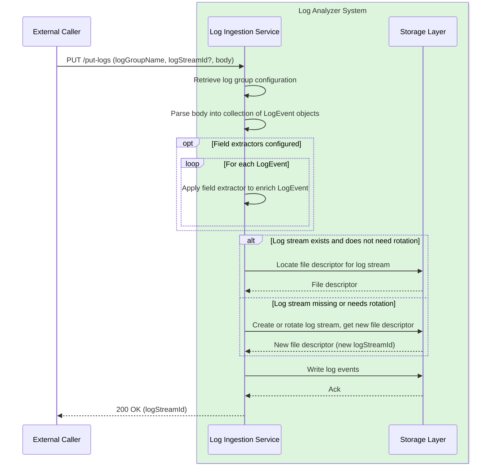

# ADR 2 - Initial ingestion layer

This ADR covers requirements R00, R01 and R03-05 from the [high-level design](high-level-design.md). Note that this ADR hinges upon the conclusions of [ADR1 (log group configuration)](adr1-log-group-and-log-stream-concepts.md), so we will not come back on the notions of log group and log stream.

We will cover the following design topics, in this order:

- the PUT API to send data to the service
- the log agent (side-car process) collecting logs on disk, integrating with the PUT API and handling batching, retries and log rotation
- the data model for `LogEvent`
- the concepts of `Parser`, converting a given input data type into a `LogEvent` and `Enricher` or `FieldExtractor`, allowing to plug extra parsing behaviour to add more indexable fields than the default parser supports

## put-logs API

The `put-logs` API will be a synchronous HTTP endpoint allowing to send a batch of raw log events, in a push model. Latency should be kept low, therefore the API will enforce a maximum payload size in bytes, as well as in number of log events. These limits will be defined at the API level, and will not be configurable per log group.

Below is the contract of the endpoint:

**Request**
- `logGroupName: String`
- `logStreamId: String?`. If omitted, a new log stream will be created and the logs will be appended into it.
- `body: blob`. A binary payload (typically compressed UTF8 plain text or JSON). The payload will contain a collection of raw log events which all have to match the
  format type associated to the corresponding log group. Supported MIME types:
  - `application/gzip`
  - `application/text`
  - `application/json`

**Response**

- `logStreamId: String`. The actual log stream into which the data was written. It can be different from the value passed in the request either if it was missing in the request, or if the log stream has been rotated according to the log group's configuration to respect the maximum byte size.

**Errors**
- 400 status code if the request is invalid (e.g. un-parsable content or mismatching content type, missing log group name, inexistent log group etc)
- 404 status code if the log group or log stream specified do not exist
- 413 if the payload exceeds the maximum byte size or maximum number of records
- regular HTTP error codes for generic issues

The API will access the cached configuration of log groups to correctly handle parsing and custom field extraction if applicable. The high-level flow is described in the sequence diagram below.



## Log agent: introducing log-nanny

In practice, most clients would not want to integrate directly with the `put-logs` API. A more common production use case is to have a local log file, potentially locally rotated, which gets streamed to the log ingestion service in micro-batches, ensuring low latency for the logs to become available and searchable, which is essential for monitoring use cases.

We therefore need a component which listens to local files, creates batches of log events and sends them over to the ingestion service via the API. This component need to meet a number of technical requirements:
- **Performance**: a single service may emit large amounts of logs, which need to be submitted at least as fast as they are produced, without taking too much CPU (tasks such as log compression can at time impact production services... I've seen it).
- **Concurrency**: a single service may maintain multiple distinct log files. It could become inefficient to send logs sequentially if there are many different log groups to publish to, or a very large amount of batches to send. parallelism or at least concurrency should help with that, as this workload is mostly network-bound (expect for compression which is CPU-bound, which is why we may need both parallelism and concurrency).
- **Fault-tolerance**: if you cannot trust your logs and metrics, your cannot trust anything. We need a high degree of fault-tolerance baked in to survive, with degraded behavior sometimes, things such as corrupted logs, temporary ingestion service issues, temporary network issues etc.

It is common to use a log agent for this task. In our case, the log agent packaged as a separate zip containing a jar and a launch script. The log agent will comprise two processes at runtime, running in parallel with the application:
- a supervisor process called the log nanny
- a log poller process which performs the actual work

### The role of the log nanny

`log-nanny` is a process (most likely a bash script) which ensures that only one nanny is running on the instance at all times, starts the log poller thread and checks its status to ensure it remains alive until it terminates with a successful exit code. If not, it restarts it.

When starting, the log nanny will scan running processes for an existing nanny process. If one is already active, the second nanny will exit with an error. This is to ensure that we are not publishing the same logs from different processes, for example if a bad restart occurs. The nanny itself should not easily die, given that its function is so simple and it runs in a separate process. That said, users of the log agents should monitor log volumes to detect potential anomalies in case log ingestion is down for some reason. The nanny will also kill any existing poller process.

Once the nanny process is certain to be the only active nanny with no poller process running, it will start a single poller process and wait on it, handling error exit code scenarios. The nanny will use a trap to interrupt the wait and gracefully kill the poller, leaving it time to flush before terminating.

### Log poller configuration and behaviour

The log poller will be written in Kotlin, and have configurable behaviour. Configuration will happen in a local toml file, with one configuration per log group to publish to, with the following settings available:

| Configuration key        | Type    | Default value | Semantic                                                                                                                                                                                                                                                                                                                                       | Examples                                                     |
| ------------------------ | ------- | ------------- | ---------------------------------------------------------------------------------------------------------------------------------------------------------------------------------------------------------------------------------------------------------------------------------------------------------------------------------------------- | ------------------------------------------------------------ |
| `log.files.root`         | string  | cwd           | Directory containing the log files for this log group.                                                                                                                                                                                                                                                                                         | Any valid path                                               |
| `log.files.pattern`      | string  | N/A           | Limited glob to describe the path of the files that should be captured in a given log group. Only `*` is supported.                                                                                                                                                                                                                            | `application.log.*`                                          |
| `log.format`             | enum    | `plain-text`  | Log format. Supported values: `plain-text`, `json`, `logfmt`                                                                                                                                                                                                                                                                                   | `logfmt`                                                     |
| `log.date.field`         | string  | `timestamp`   | For `json` and `logfmt`, name of the field containing the timestamp. If the field is missing, current time will be used as a fallback. Ignored for `plain-text`                                                                                                                                                                                | Any non-empty string                                         |
| `log.date.format`        | string  | N/A           | Java date pattern used to compute the event's timestamp as well as correctly separate log events. It is required to support multi-line events (typical for Java stacktraces). The date should be the first thing on the line to be considered an event. If missing, each log line is assumed to be an event. Ignored for `json` and  `logfmt`. | `YYYY-MM-dd'T'HH:mmZ`                                        |
| `log.maxEventByteSize`   | string  | `1M`          | Maximum byte size for a single event. Larger events will be clipped to this size. This is to protect against corrupted logs or abnormally large events.                                                                                                                                                                                        | `1024` (1 kilobyte)                                          |
| `log.maxPutDelaySeconds` | integer | 60            | The maximum amount of time the poller waits.                                                                                                                                                                                                                                                                                                   | Any positive integer smaller than or equal to 3600 (1 hour). |

Example configuration:

```toml
[myapp]
files.root = "/var/log/myapp"
files.pattern = "application.log*"
format = "json"
date.field = "ts"
date.format = "dd/MMM/yyyy:HH:mm:ss Z"
ingest.maxEventByteSize = "512K"

[nginx]
files.root = "/var/log/nginx"
files.pattern = "access.log*"
format = "plain-text"
date.format = "dd/MMM/yyyy:HH:mm:ss Z"
ingest.maxEventByteSize = "1M"
```

Below is a summary of the poller's basic loop:
- for each configured log group
	- list the files matching the pattern, sort them and take the first
	- wait for enough events to be logged (or the max delay to be exceeded) and sends them to the batch API
	- record a checkpoint by indicating the last written `inode` and written byte offset
	- consume the file until eof, then loop back to the first step

To do this efficiently, we will use coroutines to parallelize network calls on a comparatively small number of threads.
### Delivery semantics and fault tolerance

The log poller will persist a checkpoint file to disk after each batch is acknowledged by the ingestion service, recording the offset up to which logs have been successfully sent, along with the inode number of the watched file. The inode allows the poller to correctly detect file rotation even if the new file reuses the same path, avoiding resuming at a stale offset in the wrong file. Since inode numbers are a Unix concept, log-nanny will only support Unix systems. The checkpoint write must be fsynced and written atomically (write to a temp file, then rename) to guarantee durability and avoid a partially written checkpoint being worse than none. Indeed, a corrupted checkpoint file would prevent the poller from doing any work and completely block the log ingestion process.

If the poller crashes and restarts, it resumes from the last checkpoint, re-sending any batch that was in-flight at the time of the crash. This gives **at-least-once delivery** semantics: in the normal case each log event is delivered exactly once, but a crash may cause the last batch to be delivered twice.

For logs, this trade-off is acceptable. Duplicate log lines around a crash event are a minor inconvenience, and the alternative — at-most-once, where unacknowledged batches are silently dropped — is far worse for an observability tool.

A future improvement would be to assign a persistent UUID to each batch (generated once and stored alongside the checkpoint), passed to the ingestion service as an idempotency key. The ingestion service could then maintain a short-lived in-memory set of recently seen UUIDs to detect and ignore duplicate submissions, effectively upgrading to exactly-once semantics without changing the transport layer.

## Log event data model

A parsed log event will be composed of the following properties:
- `timestamp: Instant`
- `message: String`. That's the raw data before any parsing.
- `level: enum?`. Valid values: `INFO`, `WARN`, `ERROR`, `CRITICAL`, `DEBUG`, `TRACE`. Populating this property will require configuring an extractor (see next section) qt the log group level for a special field named `level`. We expose it as a top-level field to make it a first-class concept, as it is so often relevant for logs.. Note that it is optional though, because for example in the future metric logs likely won't ever need to populate this field (metric logs will be logs like any others, searchable etc, but in addition will go through an aggregation pipeline).
- `fields: Map<String, Any>`. Extra fields collected by configured extractors, which will be used to create the reverse index.

## Parsers and field extractors

We will have a library of parsers based on the supported format types, and we'll make sure that adding a format is limited to adding a parser implementation and registering in the library. All parsers will output a normalized `LogEvent` object.

Applicable field extractors will execute on the `LogEvent` parsing output, to enrich it with additional fields. Adding a new extractor will be done in much the same fashion as adding a parser type. Enrichers for a given log group will be applied sequentially in a defined order. If two extractors obtain the same field, the first value will win.

Some extractors will only apply to a given log format, and some log formats may come with a built-in extractor. For example, a JSON log group will come with a JSON field extractor. For a start, we will support the following list of extractors:
- `RegexFieldExtractor`: regex-based, applicable to all formats.
- `JsonFieldExtractor`: capable of extracting any JSON path leading to a primitive value (non-primitive values will be ignored). Only applicable to JSON logs, and users will be able to configure a whitelist and a blacklist of supported paths, along with some broader modes such as `EXTRACT_ALL_FLAT`, `EXTRACT_ALL_DEEP`, `EXTRACT_NONE` etc. By default, it will be `EXTRACT_ALL_FLAT`, which extracts only top-level primitive fields.
- `LogfmtFieldExtractor`: similar to the `JsonFieldExtractor` but reserved to the logfmt format. Similar options as for the JSON extractor will exist, but without the notion of depth.